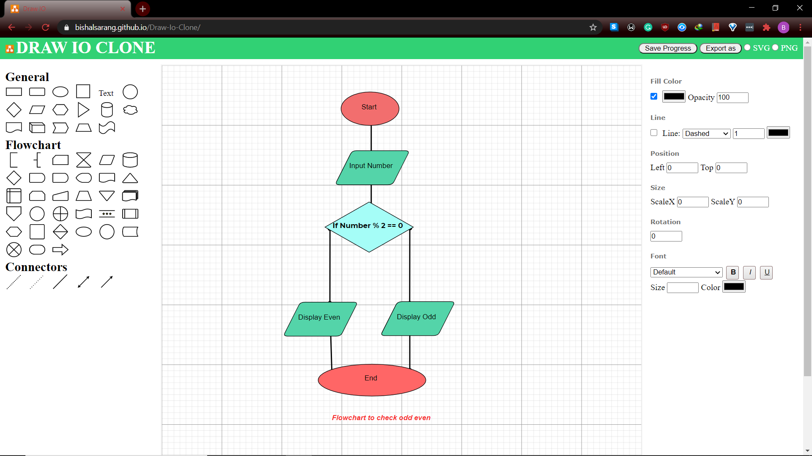

## DRAW IO CLONE

This repository contains the code for Draw Io clone which was done as an internship project at Leapfrog Inc.
The code is written in pure HTML, CSS and JS with no third party libraries and dependencies.

You can view the preview here: [http://bishalsarang.github.io/Draw-Io-Clone](http://bishalsarang.github.io/Draw-Io-Clone)

### Running the project

1. Clone the repository

   ```bash
   git clone https://github.com/Bishalsarang/Draw-Io-Clone
   ```

2. Open index.html using any http server(I prefer python's default server)

   ```bash
   cd Draw-Io-Clone
   ```

   If you are on Linux:

   ```
   python3 -m http.server
   ```

   Or on Windows

   ```
   python -m http.server
   ```

   assuming you have python already installed

3. Open the served URL

### Screenshots

#### Continue with previously saved progress


#### Main Drawing Area



#### Exported PNG diagram


